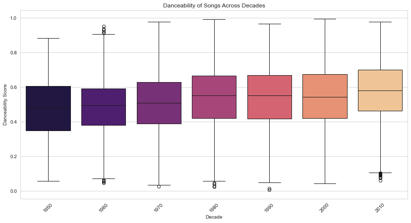
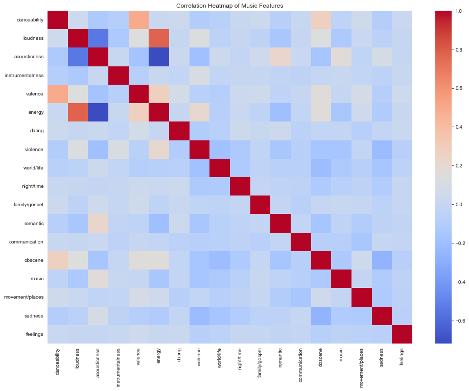

# Analysis of Music Trends from 1950-2020

## Project Overview

This project performs a comprehensive Exploratory Data Analysis (EDA) on a dataset of over 28,000 songs, spanning from 1950 to 2020. The goal is to uncover trends in music evolution by analyzing audio features (like danceability, energy, acousticness) and lyrical content. This analysis serves as the foundation for a future machine learning model to predict song popularity or genre.

---

## Dataset

The dataset used is the "CEDs Music Dataset," containing audio and lyrical features for songs from 1950 to 2020.

* **Source:** [Kaggle](https://www.kaggle.com/datasets/saurabhshahane/music-dataset-1950-to-2019/data)
* **Key Features:** `release_date`, `genre`, `danceability`, `energy`, `loudness`, `acousticness`, `valence`.

---

## Key EDA Findings

My analysis revealed several key insights into how music has evolved:

1.  **Music is Getting More Danceable:** The median danceability of songs has steadily increased over the decades,peaking in the 2010s.
    **

2.  **The Energy-Acousticness Trade-off:** There is a strong negative correlation between `energy` and `acousticness`. Songs with acoustic instruments tend to be lower in energy, while high-energy songs are rarely acoustic.
    **

3.  **Positive Music is Danceable:** `Valence` (musical happiness) and `danceability` have a moderate positive correlation, suggesting that happier-sounding tracks are generally easier to dance to.

4.  **Dominance of Pop:** The dataset is heavily skewed towards the 'pop' genre, which is an important consideration for any future modeling.

---

## Technologies Used

* Python
* Pandas
* NumPy
* Matplotlib
* Seaborn
* Jupyter Notebook

---

## Future Work

The next phase of this project will involve building a machine learning model. Using the cleaned data and insights from this EDA, I plan to:

-   [ ] **Predict Song Genre:** Build a classification model to predict a song's genre based on its audio features.
-   [ ] **Feature Importance:** Analyze which audio features are most influential in determining a song's characteristics.

---

## How to Run

1.  Clone this repository.
2.  Install the required libraries: `pip install pandas numpy matplotlib seaborn jupyter`
3.  Open the `notebooks/01_EDA.ipynb` file in Jupyter Notebook to view the full analysis.
